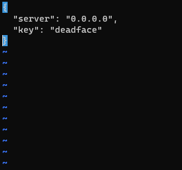
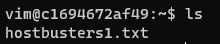
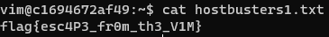

# Host Busters 1 (50)

## Challenge Description
Turbo Tactical has gained access to a DEADFACE machine that belongs to gh0st404. This machine was used to scan one of TGRI’s websites. See if you can find anything useful in the vim user’s directory.

On a side note, it’s also a good idea to collect anything you think might be useful in the future for going after DEADFACE.

Submit the flag as ```flag{flag_here}```.

```vim@gh0st404.deadface.io```

Password: ```letmevim```

## Solution

When SSHing into the provided machine, we get trapped in vim:


This can be easily escaped in two ways:  
Either running ```:set shell=/bin/bash``` and then running ```:shell```,
or running ```:!/bin/bash```.

Running ```ls``` in the newly opened shell shows one file in the home directory:  


Running ```cat``` on this file gives us our flag.  
  

```flag{esc4P3_fr0m_th3_V1M}```