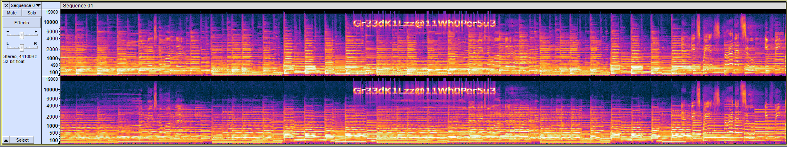
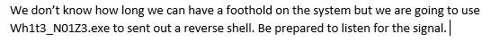

# Tin Balloon (150)

## Challenge Description
We've discovered that DEADFACE was somehow able to extract a fair amount of data from Techno Global Research Industries. We are still working out the details, but we believe they crafted custom malware to gain access to one of TGRI's systems. We intercepted a Word document that we believe mentions the name of the malware, in addition to an audio file that was part of the same conversation. We're not sure what the link is between the two files, but I'm sure you can figure it out!

Submit the flag as: ```flag{executable_name}```. Example: ```flag{malware.exe}```.

## Solution

The challenge provides ```Sequence 01.zip``` which contains two files: A password protected Word Document ('Untitlednosubject.docx'), and an mp3 file ('Sequence 01.mp3').

Listening to the mp3 file yields nothing except for a very high-pitched noise at around 3:18, however when opening it in Audacity and viewing it in Spectrogram view, we can see the password to the document.  
  

Reading the docx file reveals the name of the malware's executable:
  

Our flag is ```flag{Wh1t3_N01Z3.exe}```.