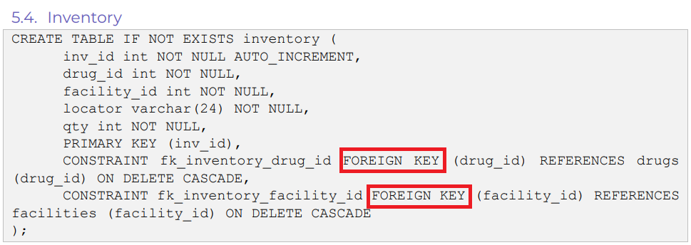

## Challenge Description
How many foreign keys are described in the design of the inventory table?

Submit the flag as flag{#}.

Use the database dump from ***Aurora Compromise***.

## Solution
No SQL queries are required for this challenge, this information can be found on page 13 of the System Design Specification document.


Two foreign keys are declared in the table, meaning our flag is ```flag{2}```.