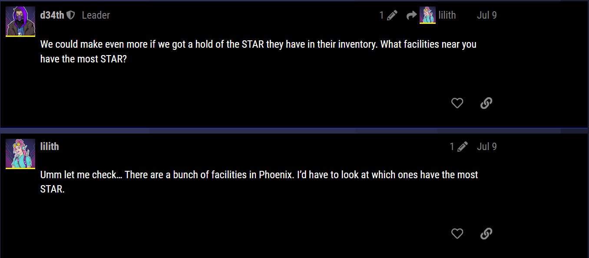

# Clean Up on Aisle 5 (300)

## Challenge Description
Based on Ghost Town conversations, DEADFACE is going to try to compromise an Aurora Health pharmacy to get their hands on STAR. Turbo Tactical wants to provide security personnel at Aurora with information about which facility, aisle, and bin contains the most STAR, since it is likely what DEADFACE will target.

Provide the facility_id, aisle, and bin where the most STAR is kept in the city DEADFACE is targeting. Submit the flag as flag{facility_id-aisle-bin}.

Example: flag{123-4-8}

Use the database dump from ***Aurora Compromise***.

## Solution

There is a post on GhostTown that says the city that DEADFACE is targeting:


To get the quantity of STAR stored in every facility in Phoenix we can run this query:

```sql
SELECT * FROM inventory WHERE drug_id = 26 AND facility_id IN(SELECT facility_id FROM facilities WHERE city = "Phoenix") ORDER BY qty DESC;
```

Which will return this data:

```sql
+--------+---------+-------------+---------+------+
| inv_id | drug_id | facility_id | locator | qty  |
+--------+---------+-------------+---------+------+
|  29078 |      26 |         412 | A11B44  | 2740 |
|   3211 |      26 |         567 | A11B51  | 2737 |
|  19980 |      26 |         706 | A4B20   | 2573 |
|  24607 |      26 |        1058 | A7B25   | 2524 |
|   3374 |      26 |         434 | A43B51  | 2480 |
|  29609 |      26 |          40 | A39B38  | 2411 |
|   4696 |      26 |         178 | A17B32  | 2023 |
|  16071 |      26 |        1388 | A30B23  | 1853 |
|  19353 |      26 |         442 | A23B24  | 1382 |
|  23588 |      26 |        1110 | A17B49  |  573 |
|  12751 |      26 |         215 | A45B34  |  463 |
|  28009 |      26 |        1022 | A8B24   |  159 |
|  20182 |      26 |        1113 | A43B39  |  137 |
+--------+---------+-------------+---------+------+
```

Facility 412 has the most STAR stored in Aisle 11, Bin 44. Our flag is ```flag{412-11-44}```.