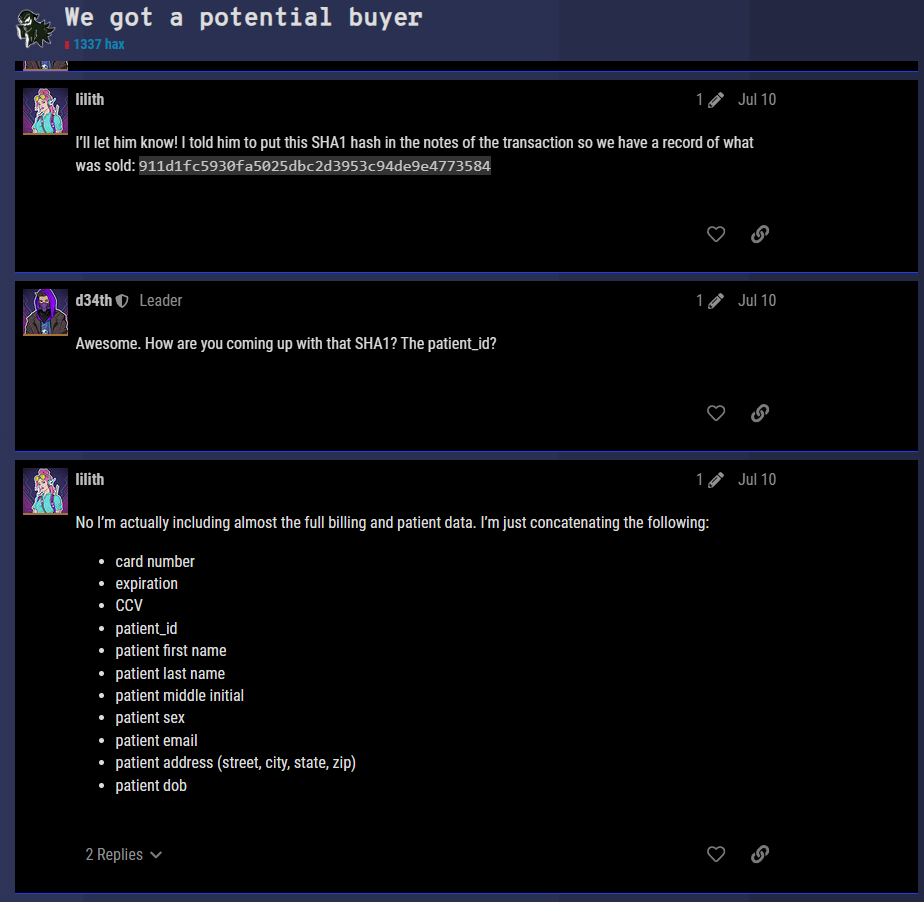

# SHAttered Dreams (400)

## Challenge Description

DEADFACE is on the brink of selling a patient's credit card details from the Aurora database to a dark web buyer. Investigate Ghost Town for potential leads on the victim's identity.

Submit the flag as ```flag{Firstname Lastname}```. Example: ```flag{John Smith}```.

Use the database dump from ***Aurora Compromise***.

## Solution

A quick look through GhostTown allows us to find this post showing a SHA1 hash we need to crack, as well as a list of SQL fields that were concatenated to generate the hash.


### Query
```sql
SELECT CONCAT(card_num,exp,ccv,billing.patient_id,first_name,last_name,middle,sex,email,street,city,state,zip,dob)
FROM billing 
INNER JOIN patients ON billing.patient_id = patients.patient_id 
INTO OUTFILE '/tmp/data.txt';
```

#### Query Breakdown

CONCAT() will concatenate the fields selected, in the order that they are provided.  
You can use either ```billing.patient_id``` or ```patients.patient_id``` for this, however if you don't specify either the query will fail due to the ```patient_id``` field being ambiguous.

'INNER JOIN' joins the ```billing``` and ```patients``` tables together, and will only return rows where the fields declared after the 'ON' keyword are equal.

'INTO OUTFILE' will output the data into the specified file, instead of printing the result to the table.

First line of data.txt:
```
51087554177993422025-037588151LorrayneCoveyEFemalelcovey0@wunderground.com40411 Old Shore StreetHoustonTX772011985-02-08
```

### Cracking the hash

Running ```hashcat -m 100 hash.txt data.txt``` will result in the string used to generate the hash, which is;

```
50483743238485412026-0498316314BertonLuchettiXMalebluchetti6ar@taobao.com39 Meadow Ridge TerraceClevelandOH441251964-10-29
```

Our flag is ```flag{Berton Luchetti}```.